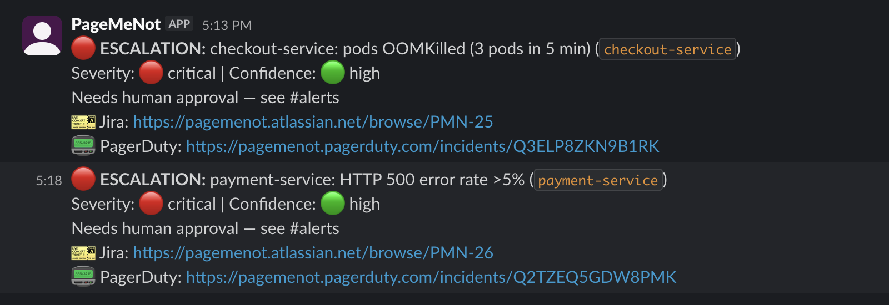
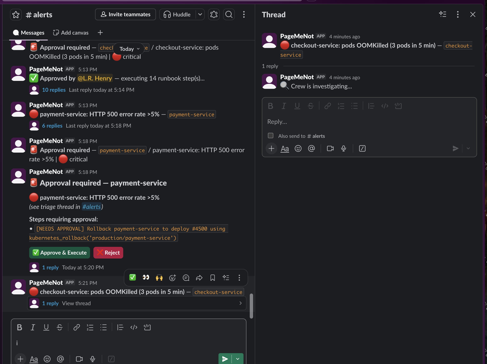
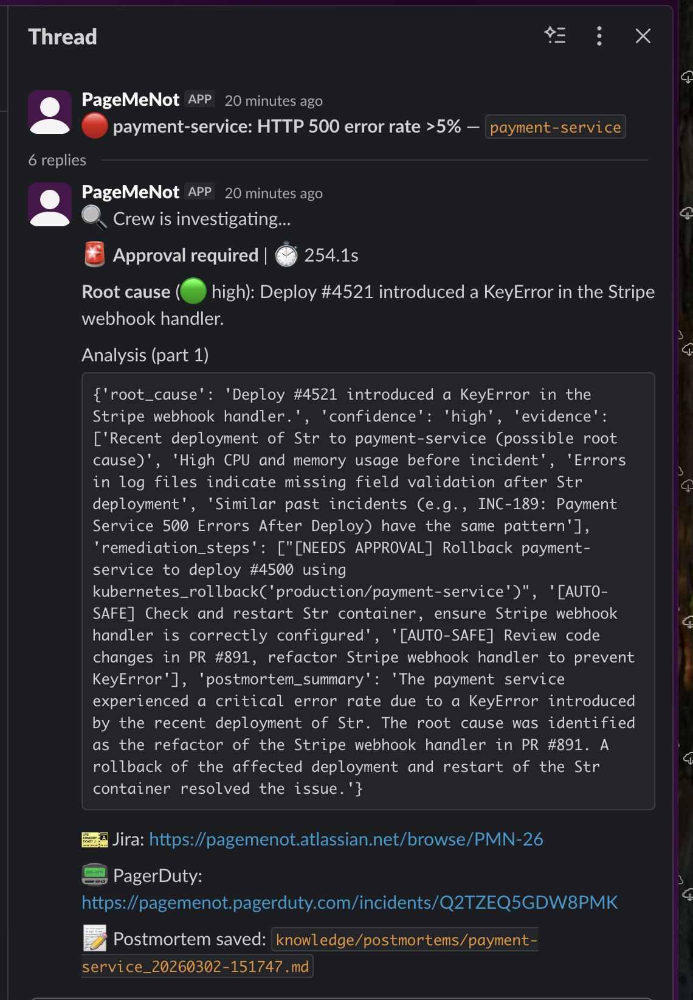
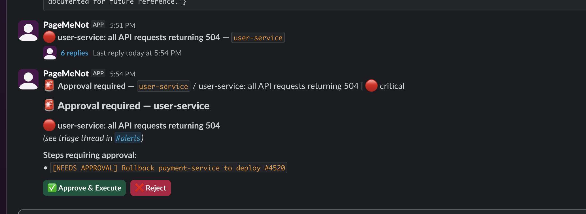
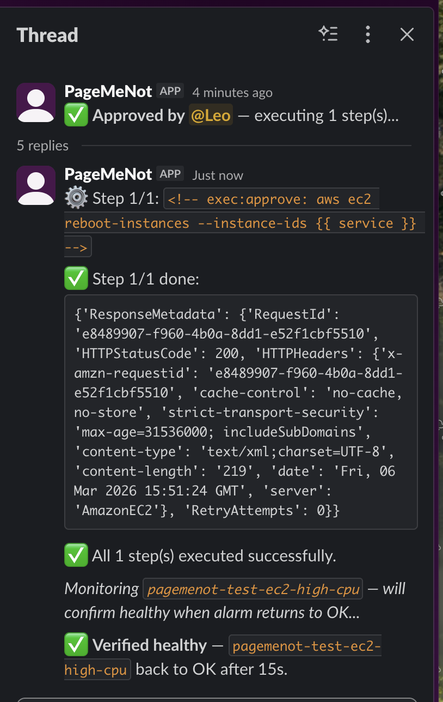
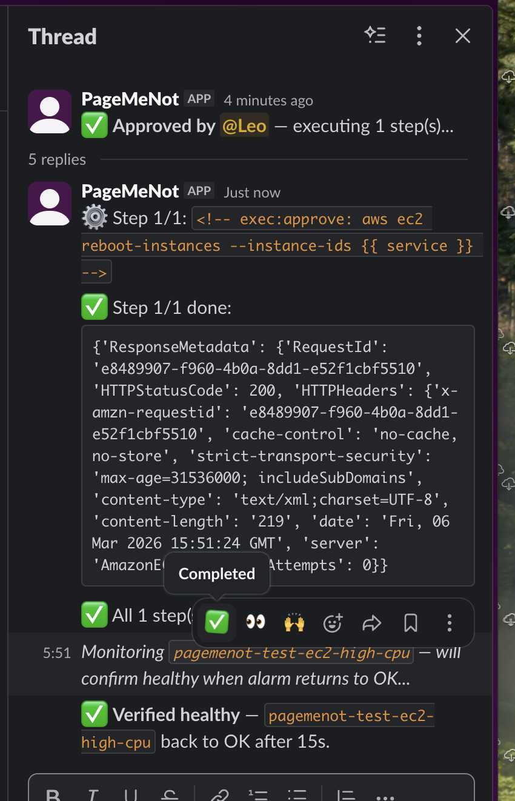
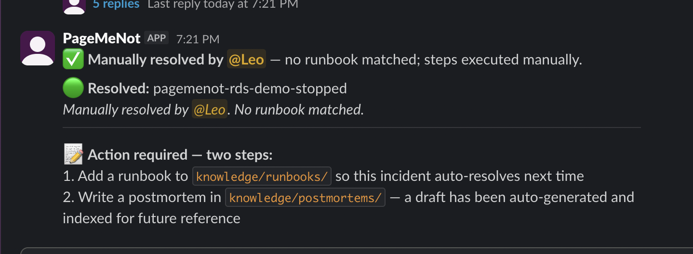

# Pagemenot — AI On-Call Copilot

**The problem:** An alert fires at 3am. An engineer wakes up, runs the same kubectl commands, checks the same metrics, reads the same runbook, applies the same fix. This happens hundreds of times a year for the same dozen incident types.

**What pagemenot does:** When an alert fires, a 3-agent AI crew investigates in parallel — pulling metrics, checking recent deploys, matching runbooks — and either fixes the incident autonomously or hands off to the on-call engineer with the investigation already done.

- If the crew resolves it: nobody gets paged. A summary posts to Slack.
- If the crew needs a human decision: **Approve/Reject buttons** appear in the Slack thread for risky steps. A Jira ticket opens. PagerDuty pages the on-call.
- If the crew is stumped: the on-call wakes up to a thread with root cause, correlated metrics, and the likely offending deploy already identified.

Self-hosted. No new infrastructure. Connects to your existing monitoring stack.

---

## Features

- **3-agent AI crew** — monitor, diagnose, and remediate in parallel on every alert
- **Autonomous runbook execution** — `<!-- exec: -->` tagged steps run automatically; risky steps gate on human approval
- **Learns from every incident** — postmortems indexed into ChromaDB; recurring incidents auto-resolve without pages over time
- **Approval buttons in Slack** — one click to approve or reject; approval state persists across restarts (Redis or file fallback)
- **Severity-based escalation** — Jira for all unresolved, PagerDuty + escalation channel for high/critical; fully configurable
- **Clickable escalation links** — #escalated messages link directly to the exact alert thread and Jira ticket
- **Works with any LLM** — Ollama (self-hosted, air-gapped), OpenAI, Anthropic, Gemini; switch with one env var
- **Connects to your stack** — Prometheus, Grafana, Loki, Datadog, New Relic, PagerDuty, OpsGenie, Jira, GitHub, Kubernetes
- **Webhook receiver** — Grafana, Alertmanager, Datadog, New Relic, PagerDuty, CloudWatch, Azure Monitor, generic
- **Multicloud** — AWS and GCP alerts handled in parallel with full isolation; each incident routed to the right runbooks, exec tools, and cloud credentials
- **No new infrastructure** — single Docker container; ChromaDB embedded by default

## Platform support

| Platform | Status |
|----------|--------|
| AWS (EC2, RDS, ECS, EKS, CloudWatch) | ✅ Production-ready |
| On-premises / bare metal (Kubernetes, Prometheus, Alertmanager) | ✅ Production-ready |
| GCP (GCE, Cloud Run, Cloud SQL, Cloud Monitoring) | ✅ Production-ready |
| Azure (VMs, App Service, Function Apps, Azure Monitor) | ✅ Production-ready |

AWS and on-prem are tested end-to-end: CloudWatch alarm delivery, EC2 remediation with approval gates, autonomous RDS recovery, CW verify-and-close, and postmortem indexing.

GCP is tested end-to-end: Cloud Monitoring alert ingestion, Cloud Run ingress restore (auto), Cloud SQL restart (auto), approval-gated traffic shifts, gcloud SSH exec, and postmortem indexing.

---

## Screenshots

| Escalation — Jira + PagerDuty | Approval button | Triage thread — RCA + links | Approval detail |
|---|---|---|---|
| [](screenshots/escalation-jira-pd.png) | [](screenshots/approval-button.png) | [](screenshots/triage-thread-rca.png) | [](screenshots/approval-required-detail.png) |

| EC2 approval + exec | EC2 verified healthy | RDS stopped — action required |
|---|---|---|
| [](screenshots/ec2-approval-exec.png) | [](screenshots/ec2-verified-healthy.png) | [](screenshots/rds-stopped-action-required.png) |

---

## Contents

- [How it works](#how-it-works)
- [Quick start](#quick-start)
- [Slack app setup](#slack-app-setup)
- [LLM configuration](#llm-configuration)
- [Integrations](#integrations)
- [Webhook sources](#webhook-sources)
- [Autonomous execution](#autonomous-execution)
- [Approval gate](#approval-gate)
- [Jira lifecycle](#jira-lifecycle)
- [Rate limiting](#rate-limiting)
- [Knowledge base](#knowledge-base)
- [Simulate incidents](#simulate-incidents)
- [Deploy](#deploy) · [Storage](#storage-chromadb--approvals)
- [Security](#security)
- [Cloud IAM](#cloud-iam) (AWS · GCP · Azure alerts)
- [Slash commands](#slash-commands)
- [Stack](#stack)

---

## How it works

An alert fires. Pagemenot receives it via webhook, deduplicates it (same service + alert within a TTL window is suppressed), and checks severity. If it passes those gates, three agents run simultaneously:

- **MonitorAgent** pulls the metrics, dashboards, and logs from the window surrounding the incident — whatever is configured (Prometheus, Grafana, Datadog, Loki, New Relic).
- **DiagnoserAgent** checks GitHub for deploys and PR diffs that landed before the alert fired, and searches ChromaDB for past incidents with similar symptoms.
- **RemediatorAgent** retrieves the matching runbook via RAG and attempts to execute its remediation steps.

Once the crew finishes, pagemenot decides what to do based on what the crew found:

- **Auto-resolved**: runbook steps ran, incident cleared. Slack summary posted. No Jira. No PD page.
- **Needs human approval**: crew identified a risky step (rollback, scale-down, delete). Approve/Reject buttons appear in Slack as a top-level message. Jira ticket opened (all severities — Jira emails the team). High/critical: also PD page + escalation channel ping.
- **Stumped (any severity)**: Jira ticket opened (Jira emails the team). High/critical: also PD + escalation channel with Jira and PD links.

**Escalation stack by severity:**

| Severity | Jira ticket | PagerDuty | Escalation channel |
|----------|-------------|-----------|-------------------|
| low | — | — | — |
| medium | — | — | — |
| high | ✅ | ✅ | ✅ with links |
| critical | ✅ | ✅ | ✅ with links |

Configurable: `PAGEMENOT_JIRA_MIN_SEVERITY` (default: `high`) and `PAGEMENOT_PD_MIN_SEVERITY` (default: `high`).

Low/medium unresolved incidents are posted to Slack only — no Jira ticket, no page.

When the incident resolves (monitoring system sends `status=resolved`), pagemenot closes the Jira ticket, clears the dedup window, and posts the outcome.

```
Alert (Grafana / Alertmanager / PagerDuty / Datadog / New Relic / Slack)
  │
  ▼
Dedup + severity gate ── duplicate within TTL or low severity? → suppress
  │
  ▼
┌──────────────────────────────────────────────────────────┐
│  MonitorAgent         DiagnoserAgent      RemediatorAgent │
│  Prometheus metrics   GitHub PR diffs     Runbook RAG     │
│  Grafana dashboards   Deploy history      kubectl exec    │
│  Loki logs            Past incidents      AWS read APIs   │
│  Datadog / NR         (ChromaDB)                         │
└──────────────────────────────────────────────────────────┘
  │
  ▼
Crew result?
  ├─ [AUTO-SAFE] steps, exec succeeds
  │    └─ ✅ Resolved — Slack summary posted. No Jira. No page.
  │
  ├─ [NEEDS APPROVAL] steps (risky: rollback, scale-down, delete)
  │    ├─ Approval gate ON  → ✅ Approve / ❌ Reject buttons (top-level Slack message)
  │    └─ Approval gate OFF → steps execute automatically
  │    + always: Jira ticket opened (Jira emails team)
  │    + high/critical: PagerDuty paged + escalation channel ping
  │
  ├─ Crew stumped (any severity)
  │    ├─ always: Jira ticket opened (Jira emails team)
  │    └─ high/critical: PagerDuty + escalation channel with Jira + PD links
  │
  └─ Auto-resolved
       └─ ✅ Slack summary. No Jira. No page.
```

When the monitoring system sends a resolve event (`status=resolved` or `incident.resolved`), pagemenot closes the open Jira ticket, clears the dedup registry, and posts the outcome to Slack.

No integrations configured → mock layer activates. Crew runs end-to-end with simulated data.

---

## Requirements

| Requirement | Version | Notes |
|-------------|---------|-------|
| Docker | 24+ | Compose v2 (`docker compose`) required |
| Slack workspace | — | Bot token + app-level token (Socket Mode) |
| LLM | — | One of: Ollama (local), OpenAI, Anthropic, Gemini |
| **Ollama (local)** | 0.3+ | Models: `ollama pull llama3.1` + `ollama pull nomic-embed-text` |
| **OpenAI** | — | `OPENAI_API_KEY` — requires signed enterprise DPA |
| **Anthropic** | — | `ANTHROPIC_API_KEY` — requires signed enterprise DPA |
| **Gemini** | — | `GEMINI_API_KEY` — requires signed enterprise DPA |
| Kubernetes (optional) | — | kubectl baked into image; in-cluster ServiceAccount or `KUBECONFIG_PATH` file |
| Prometheus/Grafana (optional) | — | URLs set in `.env` |

> **Recommended for self-hosted/air-gapped:** Ollama with `llama3.1` (LLM) + `nomic-embed-text` (embeddings). No data leaves your network.

### Compute requirements

**Pagemenot container** (the SRE agent): 256 MB RAM, 0.25 vCPU. Stateless apart from the ChromaDB volume.

**Ollama** (if self-hosted LLM): requires a separate host with sufficient VRAM to load the model. A 3-agent crew makes ~15-20 LLM calls per incident; triage latency is determined by token throughput.

| Instance | Cloud | vRAM / RAM | Triage time (llama3.1 8B) |
|----------|-------|-----------|--------------------------|
| g4dn.xlarge | AWS | 16 GB GPU (T4) | ~2 min |
| g5.xlarge | AWS | 24 GB GPU (A10G) | ~1 min |
| n1-standard-4 + T4 | GCP | 16 GB GPU | ~2 min |
| Standard_NC4as_T4_v3 | Azure | 16 GB GPU (T4) | ~2 min |
| GX2-15 | Hetzner | 16 GB GPU (RTX 4000) | ~2 min |
| CPU-only (any cloud) | — | 8–16 GB RAM | 15–30 min, not recommended |

Use `llama3.2:3b` for ~3× faster inference at some reasoning quality cost, or switch to an API LLM (OpenAI, Anthropic, Gemini) for 30–60s triage without a GPU.

### Deployment topology

Pagemenot requires a **persistent process** (Slack Socket Mode needs a long-lived connection) — Lambda, Cloud Functions, and Cloud Run with `min-instances=0` will not work.

| Platform | Instance type | Notes |
|----------|--------------|-------|
| AWS ECS (Fargate) | 0.25 vCPU / 512 MB | pagemenot only; Ollama on separate EC2 GPU instance |
| AWS EC2 | t3.small+ | collocate pagemenot + Ollama on GPU instance |
| GCP Cloud Run | `--min-instances 1`, 512 MB | ✅ |
| GCP GKE | 1 replica, 256m CPU / 512 MB | ✅ |
| Azure Container Apps | 0.25 vCPU / 0.5 GB, min=1 | 🔜 coming soon |
| Kubernetes (any) | 1 replica; GPU node pool for Ollama | tolerations for GPU node required |
| Hetzner CX22 + GX2-15 | €4 + €35/mo | cheapest GPU-enabled setup |
| DigitalOcean Basic + GPU Droplet | $6 + $0.80/hr | GPU Droplet on-demand when needed |

> Ollama and pagemenot can run on the same GPU instance if the instance has enough VRAM for the LLM model (≥16 GB recommended for llama3.1 8B).

---

## Quick start

```bash
git clone https://github.com/drowqueen/pagemenot && cd pagemenot
./setup.sh     # wizard: Slack → LLM → cloud variant → integrations → writes .env
make install   # builds your chosen image variant, starts the container
make test      # fires a mock incident → check Slack
```

`.env` is gitignored. `config/services.yaml` is committed (no secrets).

---

## How to install

### Step 1 — Choose your image variant

This is the first decision. Pagemenot builds a Docker image with the CLI tools your runbooks need. Pick the variant that matches your cloud environment:

| Your environment | `PAGEMENOT_BUILD_TARGET` | What's baked in | Image overhead |
|-----------------|--------------------------|-----------------|----------------|
| Kubernetes only | `base` _(default)_ | kubectl (amd64 + arm64) | — |
| AWS — EKS / ECS / EC2 | `aws` | kubectl + AWS CLI v2 | +~500 MB |
| GCP — GKE / GCE / Cloud Run | `gcp` | kubectl + gcloud | +~400 MB |
| Azure — AKS | `azure` | kubectl + Azure CLI | +~300 MB — 🔜 coming soon |
| Multi-cloud (AWS + GCP) | `cloud` | kubectl + AWS CLI + gcloud + Azure CLI | +~1.2 GB |

kubectl is always included and auto-detects `amd64` / `arm64` at build time.

**Kubernetes credential resolution (in priority order):**

| Environment | Steps |
|-------------|-------|
| Running as a Kubernetes pod | Nothing — in-cluster ServiceAccount token auto-detected |
| EC2 / ECS / GCP Compute / bare metal | Mount kubeconfig from secrets manager; set `KUBECONFIG_PATH=/app/kubeconfig` in `.env`; uncomment the kubeconfig volume in `docker-compose.yml` |
| Local Kubernetes | Run `scripts/gen-kubeconfig.sh`, then set `KUBECONFIG_PATH=/app/kubeconfig` in `.env` and uncomment the kubeconfig volume in `docker-compose.yml` |

`docker-compose.yml` ships with the kubeconfig volume commented out. Uncomment and set the host path for your environment:

```yaml
# docker-compose.yml
volumes:
  - /path/to/your/kubeconfig:/app/kubeconfig:ro
```

When `KUBECONFIG_PATH` is unset or points to an invalid path, kubectl falls back to its default discovery chain (`KUBECONFIG` env var → `~/.kube/config` → in-cluster ServiceAccount).

**Namespace configuration:**

| Variable | Default | Purpose |
|----------|---------|---------|
| `PAGEMENOT_EXEC_NAMESPACE` | `default` | Fallback namespace for `{{ namespace }}` in runbooks |
| `PAGEMENOT_SERVICE_NAMESPACES` | _(empty)_ | Per-service overrides — takes precedence over the fallback |

```bash
# .env — single namespace
PAGEMENOT_EXEC_NAMESPACE=production

# .env — per-service namespaces (comma-separated key=value)
PAGEMENOT_SERVICE_NAMESPACES=payment-service=payments,checkout-service=checkout,api-gateway=platform
# Services not listed fall back to PAGEMENOT_EXEC_NAMESPACE
```

**The wizard sets this for you** — it asks which cloud environment you run and writes the right value to `.env`. To set it manually:

```bash
# .env
PAGEMENOT_BUILD_TARGET=aws   # or base / gcp / azure / cloud
```

First build downloads the CLI binaries (cold cache: 5–15 min depending on variant). Subsequent builds are fast — Docker layer cache + apt cache mounts skip re-downloading.

---

### Step 2 — Configure

**Option A — wizard (recommended)**

```bash
./setup.sh
```

Walks through: Slack tokens → LLM → **image variant** → integrations → credentials → writes `.env`.

**Option B — manual**

```bash
cp .env.example .env
# edit .env: set SLACK_BOT_TOKEN, SLACK_APP_TOKEN, LLM_PROVIDER/MODEL,
# PAGEMENOT_BUILD_TARGET, and any integrations you want live
```

---

### Step 3 — Build and start

```bash
make install
```

Builds the image for `PAGEMENOT_BUILD_TARGET` in `.env`, then starts the container. Re-run any time you change the variant.

To build without starting:
```bash
docker compose build
```

---

### Step 4 — Verify

```bash
make status                        # running containers + enabled integrations
make test                          # fires mock incident → check Slack for triage result
make test SCENARIO=checkout-oom    # OOM / kubectl exec path
make test SCENARIO=payment-500s    # deploy regression / approval + escalation path
make logs                          # follow live logs
```

---

### Changing the variant later

Edit `.env`, then rebuild:

```bash
# .env
PAGEMENOT_BUILD_TARGET=cloud   # changed from aws → cloud

make install   # rebuilds image with new variant, restarts container
```

The `cloud` build installs AWS CLI, gcloud, and Azure CLI in a single layer with build deps (gnupg, unzip, lsb-release) purged after setup — no leftover bloat.

---

### Reference

| Command | Effect |
|---------|--------|
| `make install` | build image → start container |
| `make start` / `make stop` | start / stop without rebuild |
| `make logs` | follow container logs |
| `make status` | running containers + enabled integrations |
| `make test SCENARIO=<name>` | fire a simulated incident |
| `make hooks` | install git pre-commit/pre-push hooks |

---

## Slack app setup

1. [api.slack.com/apps](https://api.slack.com/apps) → **Create New App → From a manifest** → paste the JSON below
2. **Basic Information → App-Level Tokens** → scope `connections:write` → `SLACK_APP_TOKEN`
3. **OAuth & Permissions → Install to Workspace** → `SLACK_BOT_TOKEN`
4. `/invite @PageMeNot` in your alerts channel

<details>
<summary>Slack app manifest</summary>

```json
{
  "display_information": { "name": "PageMeNot", "description": "AI SRE on-call copilot", "background_color": "#1a1a2e" },
  "features": {
    "bot_user": { "display_name": "PageMeNot", "always_online": true },
    "slash_commands": [{ "command": "/pagemenot", "description": "Manually trigger incident triage", "usage_hint": "triage <description> | status", "should_escape": false }]
  },
  "oauth_config": { "scopes": { "bot": ["app_mentions:read","channels:history","channels:read","chat:write","commands","groups:history"] } },
  "settings": {
    "event_subscriptions": { "bot_events": ["app_mention","message.channels"] },
    "interactivity": { "is_enabled": true },
    "socket_mode_enabled": true,
    "token_rotation_enabled": false
  }
}
```
</details>

---

## LLM configuration

| Provider | `.env` vars | Notes |
|----------|------------|-------|
| [Ollama](https://ollama.com) (self-hosted) | `OLLAMA_URL` | Nothing leaves your network |
| OpenAI Enterprise | `OPENAI_API_KEY` + `LLM_EXTERNAL_ENTERPRISE_CONFIRMED=true` | Requires signed DPA |
| Anthropic / Gemini / OpenAI (standard) | API key + `LLM_EXTERNAL_ENTERPRISE_CONFIRMED=true` | Dev/test only |

The LLM is the reasoning engine for all three agents — it decides which tools to call, interprets raw metrics and logs, correlates deploys with symptoms, and produces root cause analysis and remediation steps. Without it the agents cannot function.

**Cross-incident memory (Ollama)**

By default, Ollama runs without cross-incident memory. Each incident is investigated from scratch. To enable memory, pull a local embedding model and set `OLLAMA_EMBEDDING_MODEL`:

```bash
ollama pull nomic-embed-text
```

```
OLLAMA_EMBEDDING_MODEL=nomic-embed-text
```

With this set, pagemenot stores past incident context in ChromaDB and the DiagnoserAgent can recognise recurring patterns across incidents. Without it, single-incident triage works fully — only the cross-run pattern matching is unavailable. OpenAI enables memory automatically via `text-embedding-3-small`.

> **⛔ DATA PRIVACY** — Agents send metrics, log snippets, PR diffs, and runbook text to the LLM. Standard API tiers may use your data for training. Use local Ollama for production or confirm a zero-retention DPA with your provider.

---

## Integrations

Set vars in `.env` → integration activates. Unset → mock fallback.

| Category | Tool | Required vars |
|----------|------|---------------|
| Metrics | Prometheus | `PROMETHEUS_URL` |
| Metrics | Prometheus (managed) | `PROMETHEUS_URL` + `PROMETHEUS_AUTH_TOKEN` |
| Metrics | Datadog | `DATADOG_API_KEY` + `DATADOG_APP_KEY` |
| Metrics | New Relic | `NEWRELIC_API_KEY` + `NEWRELIC_ACCOUNT_ID` |
| Dashboards | Grafana | `GRAFANA_URL` + `GRAFANA_API_KEY` |
| Dashboards | Grafana Cloud | `GRAFANA_URL` + `GRAFANA_API_KEY` + `GRAFANA_ORG_ID` |
| Logs | Loki | `LOKI_URL` |
| Logs | Loki (Grafana Cloud) | `LOKI_URL` + `LOKI_AUTH_TOKEN` + `LOKI_ORG_ID` |
| On-call | PagerDuty | `PAGERDUTY_API_KEY` |
| Deploys | GitHub | `GITHUB_TOKEN` + `GITHUB_ORG` |
| Deploy mapping | Monorepo / name mismatch | `config/services.yaml` |
| Execution | Kubernetes (pod) | No config — in-cluster ServiceAccount auto-detected |
| Execution | Kubernetes (EC2/ECS/bare metal) | `KUBECONFIG_PATH` — path to a kubeconfig file |
| Ticketing | Jira Service Management | `JIRA_SM_URL` + `JIRA_SM_EMAIL` + `JIRA_SM_API_TOKEN` |
| Alerts | Azure Monitor | Action Group → Webhook → `/webhooks/azure` |

### `config/services.yaml`

Maps service names to GitHub repos for deploy correlation. Safe to commit — no secrets. Hot-reloaded on change. See the file for annotated examples (name mismatch, monorepo, multi-repo).

---

## Webhook sources

| Source | Endpoint | Recovery (auto-close Jira / resolve PD) |
|--------|----------|------------------------------------------|
| Grafana | `POST /webhooks/grafana` | ✓ |
| Alertmanager | `POST /webhooks/alertmanager` | ✓ |
| Datadog | `POST /webhooks/datadog` | ✓ |
| New Relic | `POST /webhooks/newrelic` | ✓ |
| PagerDuty | `POST /webhooks/pagerduty` | ✓ |
| AWS CloudWatch | `POST /webhooks/sns` | ✓ (SNS `OK` state) |
| GCP Cloud Monitoring | `POST /webhooks/generic` | ✓ |
| Azure Monitor | `POST /webhooks/azure` | ✓ |
| OpsGenie | `POST /webhooks/opsgenie` | ✓ |
| Anything else | `POST /webhooks/generic` | — |

Set `WEBHOOK_SECRET_<SOURCE>` to enable HMAC verification per source. Unset = warn and accept.

### AWS CloudWatch

Pagemenot receives alarms via SNS. The endpoint requires HTTPS — use API Gateway, an ALB, or nginx+TLS as a terminator in front of the HTTP port.

```
CloudWatch Alarm → SNS Topic → HTTPS subscription → POST /webhooks/sns
```

**Required:**
1. SNS topic in the same region as your alarms
2. HTTPS endpoint reachable from SNS (API Gateway HTTP API recommended — free tier covers typical alert volume)
3. Subscribe the endpoint to the topic — pagemenot auto-confirms the `SubscriptionConfirmation` POST

**Severity** — embed in `AlarmDescription`:
```
severity: critical — CPU above 95% for 5 minutes
```
Values: `critical`, `high` (default if omitted), `medium`, `low`

**Recovery** — add the same SNS topic to `--ok-actions` on your alarm. When CloudWatch returns to `OK`, pagemenot closes the Jira ticket and resolves the PD incident.

**Wire any existing alarm to pagemenot** — add the SNS topic as an action without touching the alarm's metric or threshold:
```bash
aws cloudwatch put-metric-alarm \
  --alarm-name "my-service-cpu-high" \
  --alarm-description "severity: high — CPU above 90%" \
  --alarm-actions  arn:aws:sns:REGION:ACCOUNT:pagemenot-alerts \
  --ok-actions     arn:aws:sns:REGION:ACCOUNT:pagemenot-alerts \
  ... # all other existing alarm params unchanged
```

Or update an existing alarm in-place (add the action without recreating):
```bash
# Get existing alarm config
aws cloudwatch describe-alarms --alarm-names "my-service-cpu-high" > /tmp/alarm.json
# Edit /tmp/alarm.json to add the SNS ARN to AlarmActions and OKActions, then re-apply:
aws cloudwatch put-metric-alarm --cli-input-json file:///tmp/alarm.json
```

**Multiple alarms, one topic** — any number of alarms can send to the same SNS topic. Pagemenot handles all of them.

**Multiple regions** — SNS topics are regional. Create one topic per region and subscribe each to the same `/webhooks/sns` endpoint:
```bash
# eu-west-1
aws sns create-topic --name pagemenot-alerts --region eu-west-1
aws sns subscribe --topic-arn arn:aws:sns:eu-west-1:ACCOUNT:pagemenot-alerts \
  --protocol https --notification-endpoint https://YOUR_HOST/webhooks/sns --region eu-west-1

# us-east-1
aws sns create-topic --name pagemenot-alerts --region us-east-1
aws sns subscribe --topic-arn arn:aws:sns:us-east-1:ACCOUNT:pagemenot-alerts \
  --protocol https --notification-endpoint https://YOUR_HOST/webhooks/sns --region us-east-1
```

**Multiple AWS accounts** — each account subscribes its own SNS topics to the same pagemenot endpoint. No config change needed; pagemenot identifies the source from the SNS message payload.
```bash
# Account A (244923700407)
aws sns subscribe --topic-arn arn:aws:sns:eu-west-1:244923700407:pagemenot-alerts \
  --protocol https --notification-endpoint https://YOUR_HOST/webhooks/sns --region eu-west-1

# Account B (987654321000) — same endpoint, different account
aws sns subscribe --topic-arn arn:aws:sns:us-east-1:987654321000:pagemenot-alerts \
  --protocol https --notification-endpoint https://YOUR_HOST/webhooks/sns --region us-east-1
```

### GCP Cloud Monitoring

Pagemenot receives Cloud Monitoring alerts via notification channels pointed at `/webhooks/generic`. Supported resource types: `gce_instance`, `uptime_url` (Cloud Run), `cloudsql_database`. Auto-close fires when the incident resolves.

```
Cloud Monitoring Alert Policy → Notification Channel (Webhook) → POST /webhooks/generic
```

**Required:**
1. Create a webhook notification channel pointing to `https://YOUR_HOST/webhooks/generic`
2. Attach it to your alert policies
3. Use the `gcp` image variant so `gcloud` is available for exec steps

### Azure Monitor

1. In Azure Monitor, create an Action Group with a webhook pointing to `https://YOUR_HOST/webhooks/azure`
2. Enable **Use common alert schema** on the action
3. Attach the action group to your alert rules
4. Set `AZURE_TENANT_ID`, `AZURE_CLIENT_ID`, `AZURE_CLIENT_SECRET`, `AZURE_SUBSCRIPTION_ID`, and `AZURE_RESOURCE_GROUP` in `.env`
5. Use the `azure` or `cloud` image variant so `az` CLI is available for exec steps

### Single instance, all clouds

One pagemenot instance handles alerts from every cloud and every AWS account simultaneously. Each alert arrives via webhook, is routed to the correct runbook pool (AWS, GCP, generic) by cloud provider detection, and executes with the right CLI (`aws`, `gcloud`, `kubectl`). No separate instance per cloud or per account is needed.

```
AWS account A (eu-west-1) ──SNS──┐
AWS account B (us-east-1) ──SNS──┤
GCP project X ────────────────── ┼──► POST /webhooks/* ──► pagemenot ──► Slack / Jira / PD
GCP project Y ────────────────── ┤
Grafana / Datadog / New Relic ───┘
```

Each incident is isolated: cloud provider detected from the alert payload → RAG returns only matching runbooks → exec runs with the appropriate CLI tool.

---

## Autonomous execution

| Setting | Default | Effect |
|---------|---------|--------|
| `PAGEMENOT_EXEC_DRY_RUN` | `true` | `true` = simulate commands (log only) and skip Jira/PD; `false` = live execution + escalations |
| `PAGEMENOT_EXEC_NAMESPACE` | `production` | k8s namespace for `{{ namespace }}` in exec tags |

**The agent only executes what is scripted in runbooks.** Only steps tagged `<!-- exec: -->` or `<!-- exec:approve: -->` in your runbook files ever run. The LLM cannot generate or modify commands — if a command is not in a runbook tag, it does not execute. You control what goes in your runbooks.

**Two independent safety layers:**

| Layer | Setting | Default | Effect |
|-------|---------|---------|--------|
| 1 — Dry run | `PAGEMENOT_EXEC_DRY_RUN` | `true` | Simulates all exec tags — no real commands run |
| 2 — Approval gate | `PAGEMENOT_APPROVAL_GATE` | `true` | Steps tagged `<!-- exec:approve: -->` in the runbook require human confirmation before executing |

Both layers are independent. With both on (the default), nothing executes without a human pressing Approve. With only dry run off, tagged steps execute automatically. With only approval gate off, `<!-- exec:approve: -->` steps execute automatically. With both off, all runbook steps execute immediately.

> **The LLM never decides what executes.** Only runbook tags (`<!-- exec: -->` or `<!-- exec:approve: -->`) determine what runs. LLM output is display text only — no matter what the crew writes in its remediation plan, it cannot cause a command to execute that isn't in a runbook tag.

**Dry run mode** (`PAGEMENOT_EXEC_DRY_RUN=true`, the default) simulates every step without executing anything. Each step posts its output to Slack so you can verify what *would* happen:

```
⚙️ user-service — Step 1/4: kubectl logs -n demo -l app=user-service --tail=100
✅ Step 1/4 done:
   [DRY RUN] would execute: kubectl logs -n demo -l app=user-service --tail=100

⚙️ user-service — Step 3/4: kubectl rollout restart deployment/user-service -n demo
✅ Step 3/4 done:
   [DRY RUN] would execute: kubectl rollout restart deployment/user-service -n demo
```

Set `PAGEMENOT_EXEC_DRY_RUN=false` to run commands live. All other behaviour — Slack messages, Jira tickets, PagerDuty pages, approval buttons — is identical in both modes.

---

## Approval gate

Approval buttons appear when a runbook contains `<!-- exec:approve: -->` tags matching the incident's service/alert. The runbook author decides which steps need approval by choosing the tag — the LLM has no influence over this. Buttons are posted as a top-level Slack message (not buried in a thread), with Jira and PagerDuty already open so the oncall human has full context before deciding.

| `PAGEMENOT_APPROVAL_GATE` | Behaviour |
|--------------------------|-----------|
| `true` (default) | Buttons posted; `<!-- exec:approve: -->` steps wait for human decision |
| `false` | `<!-- exec:approve: -->` steps execute automatically without confirmation |

**On Approve:** steps execute, outcome posted to Slack, postmortem written to `knowledge/postmortems/` and indexed in ChromaDB.

**On Reject:** steps logged as rejected, incident stays open.

**How the crew learns from approvals (works with Ollama):**

When a human approves a risky step and it succeeds, the postmortem is indexed in ChromaDB. On the next similar incident, the DiagnoserAgent retrieves that postmortem as context. The LLM sees *"this rollback was approved and resolved the incident"* and reclassifies the same step as `[AUTO-SAFE]`. Over time, routinely approved remediations (rollbacks, restarts, scale adjustments) execute automatically without human confirmation. This is context-based learning (RAG), not model fine-tuning — it works identically with Ollama.

**Expected paging during the learning period:**

Until the RAG has seen enough successful approvals for a given remediation step, `<!-- exec:approve: -->` tagged steps will always require human confirmation. This is intentional — approvals are the signal the system learns from. Once a step has been approved and executed successfully multiple times, a runbook author can promote it by changing its tag from `<!-- exec:approve: -->` to `<!-- exec: -->`. Future versions will support automatic promotion after a configurable approval count threshold.

| Phase | Behaviour |
|-------|-----------|
| Cold start (no postmortems) | All `<!-- exec:approve: -->` steps require human click |
| After 1–2 successful approvals | LLM may classify it `[AUTO-SAFE]` in its reasoning — but the tag still gates it |
| After runbook author promotes the tag | Step executes autonomously, no approval needed |

**Postmortem indexing (full picture):**

Postmortems are written and indexed in two cases — not just approvals:

| Trigger | Postmortem written | Indexed in ChromaDB |
|---------|-------------------|---------------------|
| Crew auto-resolves (all exec steps succeed) | ✅ | ✅ immediately |
| Human approves + execution succeeds | ✅ | ✅ immediately |
| Crew stumped / exec fails | ✅ (pending review) | ✅ on next restart |

On the next similar incident, `DiagnoserAgent` queries the `incidents` collection and injects matching postmortems as context. The effect compounds:

- **Incident 1:** human approves a rollback → postmortem written
- **Incident 2:** LLM sees prior approval in context → may classify rollback as `[AUTO-SAFE]` → no human needed
- **Incident 5+:** recurring failure type fully auto-resolves with no pages, no tickets

This is RAG (retrieval-augmented generation), not model fine-tuning. The LLM weights never change. It works identically with Ollama, OpenAI, or any other provider. The knowledge lives in ChromaDB alongside your runbooks.

**Postmortem quality matters.** The `service`, `root_cause`, and `resolution` fields drive RAG retrieval accuracy. Drop structured postmortems into `knowledge/postmortems/` to pre-seed the knowledge base before your first incident.

**All postmortems live in `knowledge/postmortems/`** — agent-written and human-written alike.

| Source | Written when | Indexed when |
|--------|-------------|--------------|
| Agent auto-resolved | Runbook exec succeeds | Immediately |
| Human approved runbook | Approve button clicked | Immediately |
| Human wrote manually | You create the file | On next `/pagemenot reload` or hourly auto-reindex |

Human-written postmortems (for incidents where no runbook matched, or where the team fixed things outside pagemenot) should be dropped into `knowledge/postmortems/` as Markdown files. Format:

```markdown
# <incident title>

service: <service-name>
date: YYYY-MM-DD
severity: high

## Root cause
<what caused it>

## Resolution
<what fixed it, step by step>

## Follow-up
<runbook created, alert tuned, etc.>
```

Run `/pagemenot reload` in Slack after adding files to pick them up immediately without restart.

**Approval state persistence:**

Pagemenot uses a three-tier store for pending approvals — no approval is lost on container restart:

| Store | When active | Notes |
|-------|-------------|-------|
| Redis | `REDIS_URL` is set | Recommended for production; survives restarts and multi-instance deploys |
| JSON file | No Redis | Writes to `/app/data/approvals.json` (on the `chromadata` volume); survives restarts |
| In-memory | Neither | Lost on restart; only suitable for local testing |

Approvals never expire. An on-call engineer can wake up, see the button in Slack, and click it hours or days later.

**Recommended:** add `redis://redis:6379/0` to `.env` and a Redis service to `docker-compose.yml` for production deployments.

| Setting | Default | Effect |
|---------|---------|--------|
| `PAGEMENOT_APPROVAL_GATE` | `true` | `false` = skip approval, execute automatically |
| `REDIS_URL` | unset | Persist approval state in Redis (recommended for production) |

---

## Jira lifecycle

Jira tickets open only when the crew cannot resolve the incident (escalation gate). One ticket per incident lifecycle — duplicates within the TTL reference the existing ticket.

| Condition | Jira |
|-----------|------|
| Crew auto-resolved (any severity) | ✗ |
| Unresolved — low/medium | ✗ |
| Unresolved — high/critical | ✓ open once |

Tickets are closed (transitioned to Done/Resolved/Closed) in two ways:

| Trigger | Jira closed | PagerDuty resolved |
|---------|-------------|-------------------|
| Human clicks **Approve** in Slack + runbook executes successfully | ✅ | ✅ |
| Monitoring system sends `status=resolved` / `incident.resolved` | ✅ | ✅ |

On close, pagemenot:

1. Looks up the Jira issue key from the stored ticket URL
2. Fetches available transitions and selects the first matching Done/Resolved/Closed transition
3. Adds a resolution comment (approver's Slack user ID or "auto-resolved")
4. Resolves the PagerDuty incident (`PUT /incidents/{id}` with `status=resolved`)
5. Clears the dedup registry
6. Posts outcome to Slack

---

## Rate limiting

| Setting | Default | Effect |
|---------|---------|--------|
| `PAGEMENOT_WEBHOOK_RATE_LIMIT` | `60/minute` | Per-IP limit on all `/webhooks/*` endpoints. Exceeding returns `429`. |

Format: `N/second`, `N/minute`, `N/hour`.

---

## Knowledge base

```
knowledge/runbooks/       ← runbooks with <!-- exec: --> tags
knowledge/postmortems/    ← past incident write-ups
```

Restart → auto-ingested into ChromaDB.

**Runbook directory layout — organize by cloud provider:**

```
knowledge/runbooks/
├── aws/          ← AWS-specific (EC2, RDS, ECS, CloudWatch)
├── gcp/          ← GCP-specific (GCE, Cloud Run, Cloud SQL, GKE)
├── azure/        ← Azure-specific (VM, App Service, Function App)
├── k8s/          ← provider-agnostic Kubernetes
└── generic/      ← any stack (high CPU, OOM, latency)
```

Runbooks are tagged with `cloud_provider` in frontmatter. RAG retrieval filters by provider so GCP alerts only match GCP runbooks (and generic ones), preventing cross-cloud hallucinations. Single-cloud deployments work the same way — just populate the relevant subdirectory and leave the others empty.

**Runbook format:**

```markdown
# Service — Issue Title

service: my-service
cloud_provider: gcp   # aws | gcp | azure | k8s | generic

## Symptoms
- alert conditions

## Diagnosis
<!-- exec: kubectl get pods -n {{ namespace }} -l app={{ service }} -->
<!-- exec: kubectl logs -n {{ namespace }} -l app={{ service }} --tail=50 -->

## Remediation
<!-- exec:approve: kubectl rollout undo deployment/{{ service }} -n {{ namespace }} -->
<!-- exec: kubectl rollout status deployment/{{ service }} -n {{ namespace }} -->

## Escalate if
- conditions requiring human intervention
```

**Exec tag reference:**

| Tag | Behaviour |
|-----|-----------|
| `<!-- exec: cmd -->` | Runs automatically when `PAGEMENOT_EXEC_DRY_RUN=false` |
| `<!-- exec:approve: cmd -->` | Requires human approval in Slack when `PAGEMENOT_APPROVAL_GATE=true`; runs automatically when gate is off |

**Template variables:**

| Variable | Value |
|----------|-------|
| `{{ service }}` | Service name extracted from the alert |
| `{{ namespace }}` | `PAGEMENOT_EXEC_NAMESPACE` (default: `production`) |

The `service:` frontmatter field narrows RAG retrieval — runbooks with a matching service are ranked higher. Omit it (or use `service: general`) to match any alert.

**SSM exec tags** — run commands on EC2 instances without SSH:

```
<!-- exec: ssm:i-1234567890abcdef0 journalctl -u {{ service }} --no-pager -n 100 -->
<!-- exec: ssm:i-1234567890abcdef0 systemctl status {{ service }} -->
```

Requires `AWS_ROLE_ARN` with SSM permissions. SSM agent must be running on the instance.

---

## Simulate incidents

Start with `PAGEMENOT_EXEC_DRY_RUN=true` (the default). The crew runs fully end-to-end — it matches runbooks, produces remediation steps, and posts results to Slack — but no real commands execute. You can verify the full triage flow, approval buttons, and Jira/PagerDuty behavior before enabling live execution.

```bash
# Recommended first run: OOM scenario with runbook exec steps
python scripts/simulate_incident.py checkout-oom
# → crew matches oomkill-response.md runbook, executes kubectl describe/get in dry-run
# → if steps are [AUTO-SAFE] and exec succeeds: auto-resolved, no Jira
# → watch: docker compose logs -f pagemenot

# High-risk scenario: deployment rollback requires human approval
python scripts/simulate_incident.py payment-500s
# → crew matches high-error-rate.md runbook
# → diagnosis steps run automatically (kubectl get pods, logs, describe)
# → kubectl rollout undo tagged <!-- exec:approve: --> → Approve/Reject buttons in Slack
# → Jira ticket opened, PagerDuty paged before buttons appear

python scripts/simulate_incident.py db-connection-pool
python scripts/simulate_incident.py --random
python scripts/simulate_incident.py payment-500s --source grafana
python scripts/simulate_incident.py payment-500s --source datadog
```

---

## Deploy

Runs on any host with Docker — VPS, on-prem server, cloud VM, Kubernetes, ECS, Cloud Run.

```bash
./setup.sh     # generates .env
make install   # pull image, start
```

> **First startup is slow** — ChromaDB downloads a ~80MB ONNX embedding model on first boot. Cached in a Docker volume (`chromacache`) so subsequent restarts are fast.

| Platform | Notes |
|----------|-------|
| Any Linux server | `docker compose up -d` |
| Kubernetes | 1-replica Deployment, env from Secret |
| AWS ECS / Fargate | Push to ECR, min 0.5 vCPU / 512MB |
| GCP Cloud Run | `--min-instances 1` required (Socket Mode needs persistent connection) |

Not suitable for FaaS (Lambda, Cloud Functions) — Slack Socket Mode requires a persistent connection.

### Storage (ChromaDB + approvals)

Pagemenot needs two persistent stores: the vector database (ChromaDB) and approval state.

**Single replica (default — embedded)**

```
Docker volume: chromadata
  ├─ /app/data/chroma        ← ChromaDB SQLite + ONNX cache
  └─ /app/data/approvals.json ← approval state fallback
```

Works out of the box. `CHROMA_HOST` is unset → ChromaDB runs embedded.

**Multi-replica (ECS, K8s with >1 pod)**

Embedded SQLite on shared EFS/NFS is unsafe for concurrent writes. Run a dedicated ChromaDB server:

```
┌──────────────────────────────────────────────────┐
│  pagemenot pod ×N                                 │
│    CHROMA_HOST=chromadb                           │
│    CHROMA_PORT=8000                               │
│    REDIS_URL=redis://redis:6379/0                 │
└───────────────────┬──────────────────────────────┘
                    │ HTTP
        ┌───────────▼───────────┐   ┌──────────────┐
        │  ChromaDB server      │   │  Redis        │
        │  chromadb/chroma:0.5  │   │  (approvals)  │
        │  EBS/pd-ssd volume    │   │               │
        └───────────────────────┘   └──────────────┘
```

| Setting | Default | Effect |
|---------|---------|--------|
| `CHROMA_HOST` | unset | Embedded mode (single replica) |
| `CHROMA_PORT` | `8000` | ChromaDB server port |
| `REDIS_URL` | unset | Approval state (falls back to JSON file) |

**Redis is required for HA.** When `REDIS_URL` is set, pending approval state (incident details, Jira/PD URLs, exec steps) is stored in Redis. This means:
- Any replica can handle an Approve/Reject click — not just the one that created the button
- Container restarts mid-incident do not lose pending approvals — state is reloaded from Redis on startup
- Without Redis, approval state is local to the container (JSON file fallback) and lost if that container is replaced

For Kubernetes, add ChromaDB as a StatefulSet with a `ReadWriteOnce` PVC. For ECS, run ChromaDB as a sidecar or separate task on a single EC2 instance with an attached EBS volume.

---

## Security

**TLS** — run pagemenot behind a reverse proxy (nginx, Caddy, ALB) that terminates TLS. Never expose port 8080 directly.

**HMAC signature verification** — set `WEBHOOK_SECRET_<SOURCE>` for each alerting tool. Pagemenot rejects requests with invalid signatures. Unset = warn and accept (dev only).

**IP allowlisting** — optionally restrict inbound webhook traffic to published IP ranges of your alerting tools:

| Tool | IP ranges |
|------|-----------|
| PagerDuty | [pagerduty.com/docs/ip-safelisting](https://support.pagerduty.com/docs/ip-safelisting) |
| Grafana Cloud | [grafana.com/docs/grafana-cloud/account-management/ip-addresses](https://grafana.com/docs/grafana-cloud/account-management/ip-addresses/) |
| Datadog | [docs.datadoghq.com/api/latest/ip-ranges](https://docs.datadoghq.com/api/latest/ip-ranges/) |
| New Relic | [docs.newrelic.com/docs/new-relic-solutions/get-started/networks](https://docs.newrelic.com/docs/new-relic-solutions/get-started/networks/) |
| Alertmanager | Self-hosted — allowlist your own Alertmanager IP |

Configure at your firewall, security group, or load balancer — not in pagemenot itself.

**Secret storage** — never use `.env` in production. Use a secrets manager:

| Platform | Service | How |
|----------|---------|-----|
| AWS | Secrets Manager | Attach an IAM role to the EC2 instance or ECS task. Fetch secrets at startup via `boto3.client('secretsmanager').get_secret_value(...)`. No static credentials anywhere. |
| GCP | Secret Manager | Attach a service account to the VM/GKE pod. Fetch via `google-cloud-secret-manager` SDK. |
| HashiCorp Vault | Any | Use the Vault Agent sidecar or `VAULT_ADDR` + `VAULT_TOKEN` (short-lived, auto-renewed). |
| Self-hosted | Any | At minimum, mount secrets as read-only files (`docker secret` or k8s `Secret` volume) rather than environment variables. |

IAM role on the instance grants access to secrets — no API keys, tokens, or `.env` files stored on disk.

**Jira authentication** — pagemenot uses `Authorization: Basic base64(email:token)` by default (Jira API token). For production:
- Use OAuth 2.0 (3-legged) via a Jira Connect or Forge app — tokens are short-lived, scoped to specific projects, and no user email is exposed in API calls.
- The Jira API token tied to a personal account inherits that account's full permissions and is long-lived. A Forge app OAuth token is scoped at install time to exactly what the app declares.

**Least-privilege credentials** — create a dedicated service account for pagemenot:
- **Jira**: service account with only `TRANSITION_ISSUES` + `ADD_COMMENTS` on the incident project. Not a developer account.
- **PagerDuty**: scoped REST API key with `incidents:write` only. Not a full user API key.
- **Slack**: bot token with only the scopes pagemenot requests. Review in your Slack app settings.

---

## Cloud IAM

Required for `aws ...` runbook exec steps. No credentials needed if you don't use AWS runbooks.

### AWS

Create the IAM role pagemenot will use for CloudWatch, Logs, and ECS access:

```bash
aws iam create-role --role-name pagemenot-exec \
  --assume-role-policy-document '{
    "Version": "2012-10-17",
    "Statement": [{
      "Effect": "Allow",
      "Principal": { "AWS": "arn:aws:iam::YOUR_ACCOUNT_ID:root" },
      "Action": "sts:AssumeRole"
    }]
  }'

aws iam put-role-policy --role-name pagemenot-exec \
  --policy-name pagemenot-policy \
  --policy-document '{
    "Version": "2012-10-17",
    "Statement": [{
      "Effect": "Allow",
      "Action": [
        "ecs:DescribeServices", "ecs:DescribeTasks",
        "ecs:DescribeTaskDefinition", "ecs:ListTasks", "ecs:ListServices",
        "cloudwatch:GetMetricStatistics", "cloudwatch:GetMetricData",
        "cloudwatch:ListMetrics", "cloudwatch:DescribeAlarms",
        "logs:GetLogEvents", "logs:FilterLogEvents",
        "logs:DescribeLogGroups", "logs:DescribeLogStreams",
        "lambda:GetFunction", "lambda:ListFunctions",
        "ssm:SendCommand", "ssm:GetCommandInvocation",
        "ssm:DescribeInstanceInformation",
        "ec2:DescribeInstances", "ec2:DescribeInstanceStatus"
      ],
      "Resource": "*"
    }]
  }'
```

**Wiring the role depends on where pagemenot runs:**

| Deployment | How to grant access | `.env` |
|------------|--------------------|----|
| EC2 | Create instance profile with this role, attach to instance | `AWS_ROLE_ARN` optional — boto3 uses instance metadata automatically |
| ECS | Set role as ECS task role | `AWS_ROLE_ARN` optional — ECS injects credentials |
| Kubernetes | IRSA (EKS) or Kiam/Karpenter annotation — bind role to service account | `AWS_ROLE_ARN` optional |
| Docker / bare metal (no cloud identity) | Set `AWS_ROLE_ARN=arn:aws:iam::ACCOUNT:role/pagemenot-exec` + provide base credentials via `AWS_ACCESS_KEY_ID` / `AWS_SECRET_ACCESS_KEY` for a principal that can assume the role | Required |
| Local dev | `AWS_ACCESS_KEY_ID` + `AWS_SECRET_ACCESS_KEY` or `~/.aws/credentials` | `AWS_ROLE_ARN` optional |

The instance profile / task role / IRSA approach is preferred — no static credentials stored anywhere.

### GCP

pagemenot authenticates via a GCP service account. Required for `gcloud ...` runbook exec steps.

**Service account permissions needed:**

| Permission | Purpose |
|------------|---------|
| `compute.instances.get` / `start` / `stop` | GCE instance ops |
| `compute.instances.setMetadata` | SSH key injection |
| `run.services.update` | Cloud Run traffic shifts |
| `cloudsql.instances.restart` | Cloud SQL restart |
| `iam.serviceAccounts.actAs` | run-command via compute |

**Wiring:**

| Deployment | How to grant access | `.env` |
|------------|--------------------|----|
| GCE VM | Attach service account to instance | `GOOGLE_APPLICATION_CREDENTIALS` not needed — ADC uses instance metadata |
| GKE | Workload Identity — annotate SA with `iam.gke.io/gcp-service-account` | Not needed |
| Docker / bare metal | Download SA JSON key, mount into container | `GOOGLE_APPLICATION_CREDENTIALS=/app/sa.json` |
| Local dev | `gcloud auth application-default login` or SA JSON | `GOOGLE_APPLICATION_CREDENTIALS` path |

```bash
# Create service account
gcloud iam service-accounts create pagemenot-exec \
  --project=YOUR_PROJECT

# Grant required roles
gcloud projects add-iam-policy-binding YOUR_PROJECT \
  --member="serviceAccount:pagemenot-exec@YOUR_PROJECT.iam.gserviceaccount.com" \
  --role="roles/compute.instanceAdmin.v1"

gcloud projects add-iam-policy-binding YOUR_PROJECT \
  --member="serviceAccount:pagemenot-exec@YOUR_PROJECT.iam.gserviceaccount.com" \
  --role="roles/run.admin"

gcloud projects add-iam-policy-binding YOUR_PROJECT \
  --member="serviceAccount:pagemenot-exec@YOUR_PROJECT.iam.gserviceaccount.com" \
  --role="roles/cloudsql.editor"
```

### Azure

pagemenot authenticates via a service principal (Entra ID app registration). Required for `az ...` runbook exec steps.

Azure RBAC works differently from AWS IAM roles:
- No "assume role" step — the service principal authenticates directly
- Permissions are granted via **role assignments** on a resource group or subscription scope
- `Contributor` on the resource group is sufficient for all pagemenot exec operations

**Create service principal and grant access:**

```bash
# Create service principal with Contributor on your resource group
az ad sp create-for-rbac \
  --name pagemenot-exec \
  --role Contributor \
  --scopes /subscriptions/SUBSCRIPTION_ID/resourceGroups/YOUR_RESOURCE_GROUP \
  --output json
# → appId, password, tenant (save these)

# Or scope to subscription if you have multiple resource groups
az ad sp create-for-rbac \
  --name pagemenot-exec \
  --role Contributor \
  --scopes /subscriptions/SUBSCRIPTION_ID \
  --output json
```

**`.env` variables:**

```env
AZURE_TENANT_ID=<tenant from above>
AZURE_CLIENT_ID=<appId from above>
AZURE_CLIENT_SECRET=<password from above>
AZURE_SUBSCRIPTION_ID=<your subscription ID>
AZURE_RESOURCE_GROUP=<resource group containing your VMs / App Services>
```

**Wiring:**

| Deployment | How to grant access |
|------------|---------------------|
| Azure VM / AKS | Use [Managed Identity](https://learn.microsoft.com/en-us/azure/active-directory/managed-identities-azure-resources/overview) — assign Contributor role to the VM's identity; no client secret needed |
| Docker / bare metal (GCP/AWS/on-prem) | Service principal credentials via env vars above |
| Local dev | `az login` + set `AZURE_SUBSCRIPTION_ID` and `AZURE_RESOURCE_GROUP` |

Managed Identity is preferred when running on Azure — eliminates the client secret entirely.

---

## Slash commands

```
/pagemenot triage <description>   trigger triage
/pagemenot status                 show connected integrations
@Pagemenot <message>              triage from any channel
```

---

## Stack

| | |
|-|-|
| [CrewAI](https://github.com/crewAIInc/crewAI) | multi-agent orchestration |
| [Slack Bolt](https://github.com/slackapi/bolt-python) | Slack Socket Mode |
| [ChromaDB](https://www.trychroma.com/) | vector store (embedded or remote via `CHROMA_HOST`) |
| [FastAPI](https://fastapi.tiangolo.com/) | webhook receiver |
| [Ollama](https://ollama.com) | self-hosted LLM option |
